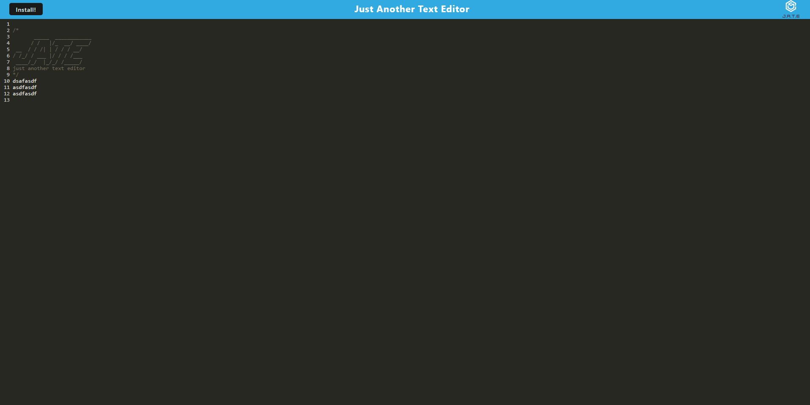

# Text Editor
# License
 
[Deployed Site](https://nameless-eyrie-80918.herokuapp.com/)

# Table of Contents
[Description](#description) 
[Installation](#installation) 
[Usage](#usage) 
[License](#license) 
[Contributing](#contributing) 
[Tests](#tests) 
[Questions](#questions) 
# Description
This is a text editor, it auto saves, and you can download the app to use it offline
# Installation
from the source folder open a command prompt and type npm i.
# Usage
View the deployed link
# Contributing
Travis Crocker
# Tests
### How to test the application.
No Tests
# Questions
### For questions contact me using the information below.
Travis.Crocker.Dev@gmail.com [github](https://Github.com/tmcrocker89)
